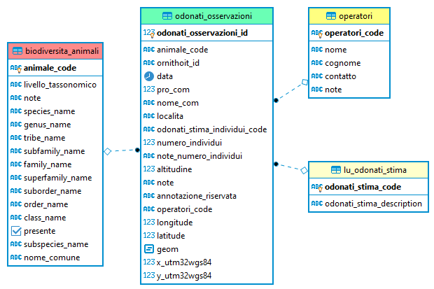

<p align="center">  </p>

### <p align="center"> DATABASE DEL PARCO NAZIONALE DELLO STELVIO</p>  

# <p align="center">MANUALE UTENTE</p>  

Questo manuale è la descrizione del database fauna del **[Parco Nazionale dello Stelvio](www.stelviopark.it)** (PNS). L'obiettivo è documentarne la struttura e le procedure di aggiornamento e consultazione.

Ultimo aggiornamento: **22/05/2020**  
Autore: **Ferdinando Urbano**  

In collaborazione con:  
**Luca Pedrotti**  
**Alessandro Gugiatti**  
**Luca Corlatti**  
**Aaron Iemma**  

### SOMMARIO  

##### *DESCRIZIONE GENERALE*  

1. **[Introduzione a PNS_DB](#Introduzione)**  
 1.1 [Scopo del database](#Scopo)  
 1.2 [Vantaggi di un database](#Vantaggi)    
 1.3 [Organizzazione dei dati](#Organizzazione)  
 1.4 [Utenti](#Utenti)  
2. **[Collegarsi al database](#Collegarsi)**  
 2.1 [pgAdmin](#pgAdmin)  
 2.2 [QGIS](#QGIS)  
 2.3 [R](#R)  
 2.4 [LibreOffice](#LibreOffice)  
 2.5 [Altri tool](#Altritool)  
 2.6 [Consultazione dei dati con SQL](#SQL)  

##### *DOCUMENTAZIONE DATABASE*  

3. **[Dati di base](#Base)**  
4. **[Dati biodiversità](#Biodiversita)**  
5. **[Dati osservazioni](#Osservazioni)**  
6. **[Dati censimenti camoscio](#Censimenti_camoscio)**  
7. **[Dati censimenti stambecchi](#Censimenti_stambecco)**  
8. **[Dati ungulati tracking](#Morti)**
9. **[Dati ungulati dinamica](#Dinamica)**
10. **[Dati cervo controllo](#Controllo)**
11. **[Dati in lavorazione](#Lavorazione)**  
12. **[Trigger e funzioni](#Triggers)**     

### <a name="Scopo"></a>Scopo del database  
Lo scopo del database **pns_db** è di archiviare i dati di monitoraggio raccolti dal Parco Nazionale dello Stelvio (tutte e sezioni) in un repository (archivio) unico dove i dati siano consistenti, accessibili e integrati fra loro evitando duplicazioni dei dati (con conseguenti potenziali errori) e rischi di perdite di dati sul lungo periodo.  
La creazione del database è stata anche l'occasione per verificare la qualità dei dati. Il database permette di (e in molti casi obbliga a) definire dei vincoli sui valori inseriti e sulle relazioni logiche fra i vari oggetti dei monitoraggi. Questo ha permesso di identificare una serie di inconsistenze e di problemi che sono stati risolti controllando i valori originali e correggendoli quando possibile, comunque documentando dati incompleti o sospetti.  

Non tutte le banche dati del Parco sono già state inserite nel database perché l'organizzazione completa delle informazioni dei vari progetti di monitoraggio è un obiettivo di lungo periodo vista la mole di dati disponibile. Ogni anno nuovi dataset (o insieme di dati riferito allo stesso progetto o ambito tematico) pregressi vengono aggiunti e soprattutto tutti i nuovi dati raccolti sul campo sono caricati nel database che è ora lo strumento di riferimento del Parco per la gestione dei suoi dati.  

Il database è sviluppato su una piattaforma [PostgreSQL](https://www.postgresql.org/) (v.11.03) con [PostGIS](http://postgis.refractions.net/) (v.2.5) come estensione spaziale.  

Il responsabile del Database PNS è il coordinatore scientifico del Parco.  

### <a name="Vantaggi"></a>Vantaggi di un database  

Un database è un'applicazione in grado di archiviare e gestire una grande quantità di dati in modo efficiente e rapido, garantendo l'integrità dei dati. Il termine "relazionale" si riferisce al modo in cui le informazioni sono archiviate nel database. Tutti i dati sono organizzati in tabelle. Ogni tabella ha la stessa struttura ripetuta in ogni riga (come un foglio di calcolo). I collegamenti fra le tabelle, realizzati da campi comuni, rendono il database "relazionale".  
L'uso di un RDBMS presenta numerosi vantaggi, in particolare:  

* rende i dati accessibili da più utenti contemporaneamente e da remoto (gli operatori del Parco possono visualizzare i dati sia dalle zone di lavoro sul campo, sia dalla sede del Parco, sia da qualsiasi posto si trovino senza avere blocchi all'uso dei dati se qualcuno ci sta lavorando in quel momento);  
* permette di definire regole sul tipo di dato archiviato (ad esempio, se il campo è numerico non può contenere testo, evitando valori non accettabili che comprometterebbero l'analisi dei dati);  
* costituisce un repository unico dove i dati vengono archiviati, evitando di duplicare i dati in molteplici versioni difficili da sincronizzare;  
* permette di definire regole sulla relazione fra i dati (ad esempio una cattura non può essere associata a una data in cui non è stato visitato il plot in cui è stata effettuata) prevenendo inconsistenze;  
* permette di definire domini (liste) di valori ammissibili per un certo attributo (evitando valori non previsti quando il dato deve essere organizzato in classi predefinite);  
* permette di definire regole specifiche per l'inserimento di nuovi dati (prevenendo errori di inserimento);  
* da la possibilità di documentare le informazioni archiviate e di associarle a metadati (semplificando il riuso dei dati da parte di chi non li ha raccolti);  
* archivia tutti i dati disponibili in uno stesso ambiente facilitando l'analisi integrata dei diversi dataset;  
* ha una capacità di archiviazione dati molto grande;  
* ha funzionalità di ricerca e recupero dati molto veloci;  
* gestisce in modo corretto i dati di tipo spaziale e temporale, con tutte le proprietà associate a questo tipo di informazioni;  
* permette di dare permessi di accesso e modifica dei dati differenziati a seconda dell'utente (ad esempio, solo gli amministratori dei dati possono modificarli);  
* garantisce la conservazione dei dati sul lungo periodo attraverso l'uso di standard consolidati e funzionalità di backup automatico.  

È importante sottolineare come la grande maggioranza del tempo di sviluppo del database sia impiegata per il controllo della qualità dei dati e per la correzione di errori ed inconsistenze (che vengono trovati appunto quando si cerca di inserire i dati in un modello strutturato, quello del database, con regole che ne preservano la coerenza e dove è semplice e veloce trovare dati che sono potenziali outlier con controlli automatici o semi-automatici). Il risultato di questo lavoro non è solo il database come strumento di gestione dei dati, ma anche la qualità complessiva dei dati, valorizzando il lavoro di campo e ampliando gli ambiti applicativi che possono beneficiare dalle informazioni in possesso del Parco.

#### Nota sul modello dati  

In generale, ogni tabella del database rappresenta un oggetto o una azione (ad esempio, i plot, le sezioni, gli osservatori, le catture, le osservazioni, gli individui, le specie, etc.). Le informazioni archiviate in ogni tabella (o relazione) sono organizzate in base al principio della **normalizzazione**, ovvero il procedimento volto all'eliminazione della ridondanza informativa e del rischio di incoerenza dal database. Questo processo si fonda su un semplice criterio: se una relazione presenta più concetti tra loro indipendenti, la si decompone in relazioni più piccole, una per ogni concetto. Al di là degli aspetti tecnici, questo vuol dire che nel database le informazioni non sono necessariamente organizzate nel modo in cui vengono raccolte e/o utilizzate dagli utenti.  
Di solito, l'interazione fra utenti e database, in particolare per l'inserimento dei dati, passa attraverso l'uso di applicativi specifici (ad esempio maschere) che permettono all'utente di immettere i dati in modo semplice e diretto, riorganizzando le informazioni "dietro le quinte" prima di essere inserite nel database. In questo caso non è previsto lo sviluppo di interfacce per l'inserimento e la consultazione dei dati, per cui il database è stato "denormalizzato" per facilitarne l'uso e l'aggiornamento da parte degli utenti. Questo ha portato a un modello dati "sub-ottimo" da un punto di vista teorico, ma molto più efficiente per il suo uso effettivo.  

#### Nota sull'aggiornamento dei dati  

Il procedimento classico per inserire dei nuovi dati è utilizzare il comando **[SQL](https://it.wikipedia.org/wiki/Structured_Query_Language)** (Structured Query Language, il linguaggio standardizzato usato per i database) **[copy](https://www.postgresql.org/docs/devel/sql-copy.html)**. A questo può essere associato un file esterno (ad esempio, un csv) che deve avere gli stessi campi e nello stesso ordine della tabella di destinazione. Ad esempio:

```sql
COPY biodiversita.epigei_monitoraggio (animale_code, nota_specie, specie_confermata, numero_indefiniti, numero_maschi, numero_femmine, note, dati_qualita_code, dati_qualita_note, taxon_code, plot_code, data_fine, trappola_code, numero_individui_totale)   
FROM  
C:/temp/dati_monitoraggio.csv DELIMITER ';' CSV HEADER;
```  
È anche possibile importare dati da un'altra tabella. Ad esempio:

```sql
INSERT INTO biodiversita.epigei_monitoraggio (animale_code, nota_specie, specie_confermata, numero_indefiniti, numero_maschi, numero_femmine, note, dati_qualita_code, dati_qualita_note, taxon_code, plot_code, data_fine, trappola_code, numero_individui_totale)  
SELECT animale_code, nota_specie, specie_confermata, numero_indefiniti, numero_maschi, numero_femmine, note, dati_qualita_code, dati_qualita_note, taxon_code, plot_code, data_fine, trappola_code, numero_individui_totale  
FROM temp.dati_monitoraggio;
```  

In alternativa è possibile usare le funzioni di importazione dati dei vari client. In particolare pgAdmin offre un'interfaccia grafica semplice e intuitiva per importare dati in una tabella da un file esterno.  

Se deve essere inserito un solo (o pochi) record o deve essere modificato il valore di alcuni (pochi) record esistenti, è possibile aprire la tabella (ad esempio in pgAdmin) e modificare o inserire manualmente i dati. Il procedimento dipende dal client utilizzato. Con le versione più recenti di pgAdmin è possibile modificare risultati di semplici query (interrogazioni) di SELECT dove viene coinvolta solo la tabella da modificare con i suoi valori originali e utilizzando la clausola WHERE per limitare i record restituiti. Ad esempio:  

```sql
SELECT *  
FROM biodiversita.epigei_monitoraggio  
WHERE numero_individui_totale > 50;
```  

#### Nota sulla convezione dei nomi dei campi

Una **chiave primaria**, nel modello relazionale delle basi di dati, è un insieme di attributi che permette di individuare univocamente un record in una tabella o relazione.  
La chiave primaria è costituita da una o più colonne della tabella (in questo secondo caso viene definita chiave composta). La chiave primaria è unica per ogni tabella. Una tabella deve obbligatoriamente possedere una e una sola chiave primaria, e nessun record nella tabella può avere il valore, o i valori, di un campo attributo identificato dalla chiave primaria identico a quello di un qualsiasi altro valore della stessa (vincolo di unicità): il tentativo di inserimento di un tale valore genera un errore di violazione della chiave primaria.  
Quando la chiave primaria è costituita da un solo campo, nel database è stata utilizzata la convenzione di chiamare quel campo *nome della tabella al singolare* + _ + *code*. Ad esempio, **plot_code** o **animale_code**. In genere questo corrisponde al nome con cui quell'oggetto viene comunemente chiamato e questo facilita l'uso del database e l'inserimento di nuovi dati quando si opera direttamente sulle tabelle. Quando invece questo non è stato possibile ad esempio perché non c'è un singolo campo o una combinazione di campi univoca che può essere utilizzata come chiave primaria, si è utilizzato un numero seriale (generato automaticamente dal database in modo da non essere mai ripetuto). In questo caso il nome convenzionale è *nome della tabella* + _ + *id*. Ad esempio **uccelli_monitoraggio_id** (schema biodiversità). In questo caso, se il record è poi riferito da altre tabelle, andrà utilizzato questo numero generato dal database (quindi non noto a priori né riportato sulle schede di campo). Nel caso in cui il campo ha un valore codificato riconosciuto universalmente, invece del suffisso *_code* si è utilizzato *_name* (ad esempio *genus_name*).  

Come nota aggiuntiva, una **chiave esterna** è invece un insieme di attributi che fa riferimento a una chiave di un'altra tabella, permettendo in tal modo di esplicitare relazioni di tipo uno a molti tra tabelle attraverso quello che è chiamato vincolo di integrità referenziale. In concreto, i valori riportati nella tabella per uno o più campi, devono essere contenuti nella tabella di riferimento (potremmo dire che per avere un figlio devi prima avere un padre). Questi vincoli corrispondono alle linee che collegano le tabelle nei grafici ER (entità-relazioni) include in questo manuale.  

I campi denominati con il suffisso *_class* hanno una tabella collegata dove sono elencati i valori ammissibili (tabella di *look up*).

### <a name="Organizzazione"></a>Organizzazione dei dati  
I dati sono organizzati in **schemi** che corrispondono alle cartelle di un *file system*. Gli schemi servono ad organizzare in modo logico le informazioni all'interno del database e a facilitare la comprensione della struttura dei dati.  
Nel pstelvio_db, ogni dataset (cioè, ogni ambito tematico oggetto di una raccolta dati) è organizzato in uno schema specifico. I particolare, al momento dell'ultimo aggiornamento di questo documento, gli schemi presenti nel database sono:

* **Biodiversità**  
* **Osservazioni**  
* **Censimenti**  
   * Camoscio
   * Stambecco
   * Capriolo
   * Cervo
* **Tracking**  
* **Morti**
* **Dinamica**
* **Controllo**

Ogni schema/dataset è descritto in dettaglio (contenuto, modello dati, procedure di inserimento e aggiornamento dati) nel seguito di questo manuale.  

Ogni oggetto dentro il database (schema, tabelle, campi, viste, funzioni) ha una descrizione associata (commento). È possibile visualizzare queste descrizioni dai software client utilizzati per interagire con il database. Spesso sono visualizzati di fianco all'oggetto, altrimenti è possibile vederli dalle proprietà dell'oggetto.

##### Nota sulla lingua di riferimento
Nel database, sia per il nome degli oggetti sia per le descrizioni e le note, si è usato a volte l'inglese e a volte l'italiano. Inizialmente si era previsto di usare sempre l'inglese per facilitare l'integrazione dei dati e delle attività del Parco in un contesto più internazionale, in particolare europeo. In alcuni casi però è risultato più semplice utilizzare l'italiano considerando anche che potenziali utenti possono non sono sapere l'inglese. In ogni caso, le note preesistenti scritte in italiano all'interno delle tabelle non sono state tradotte.  
Il risultato è un uso misto delle due lingue.  

### <a name="Utenti"></a> Utenti  
PostgreSQL offre la possibilità di decidere le operazioni che i vari utenti possono fare sugli oggetti del database (in particolare, le tabelle) attraverso un sistema di [permessi](https://www.postgresql.org/docs/devel/user-manag.html). Esempi di permessi sono la sola lettura (non è possibile inserire nuovi dati o modificare e cancellare dati esistenti), oppure lettura e scrittura (compresa modifica e cancellazione dei record esistenti), o ancora la possibilità di creare nuove tabelle o eliminare tabelle esistenti.  

Al momento ci sono 3 livelli di utenza:  
1. Amministratore del database  
(possibilità di modificare, creare o eliminare ogni oggetto del database, ed assegnare i permessi alle tabelle)  
2. Editor del database  
(possibilità di leggere e modificare i dati di tutte le tabelle ma non di creare/cancella/modificare oggetti del database)  
3. Lettore  
(possibilità di leggere i dati di tutte le tabelle del database)  

Per ogni livello esiste un "gruppo" a cui vengono associati i singoli utenti. Ogni soggetto che usa il database ha la sua utenza specifica con associata password. Questa utenza è associata a uno o più dei tre gruppi da cui eredita i relativi permessi. In questo modo i permessi di accesso alle tabelle vengono associati ai 3 gruppi e non devono essere riassegnati ogni volta che viene creato un nuovo utente (ad esempio, un nuovo collaboratore del parco).  
I soggetti interessati (e autorizzati)  possono ottenere un nome utente e una password contattando l'amministrazione del sistema.  
In futuro potranno essere create ulteriori tipologie di utenza per dati o per gruppi specifici.  

## <a name="Collegarsi"></a> Collegarsi al database  
Il database è fisicamente installato su una macchina gestita dal Parco ed è accessibile da ovunque, sia dentro sia fuori la rete interna del Parco. Funziona come un **server** centralizzato che invia i dati, quando richiesto, alle applicazioni **client**. Un client è un software che accede ad un servizio remoto (il database) installato su un altro computer (il server), tramite una rete (Internet). Il client può essere installato su un qualsiasi computer/device e il database può gestire più connessioni contemporaneamente (il database può essere usato allo stesso momento da più utenti senza rischio di corrompere i dati). Esempi di applicazioni client sono pgAdmin (per la gestione del database, per interagire con le tabelle e per interrogare i dati), QGIS e volendo anche ArcGIS (per visualizzare i dati spaziali), R (per analisi statistiche), fogli di calcolo come Calc di Libreoffice o anche Excel (per visualizzare ma non modificare i dati delle tabelle). Un altro client interessante è [DBeaver](https://dbeaver.io/) (per interrogare i dati e per creare degli schemi con il modello dati come quelli riportati in questo documento). In generale, praticamente tutti i software per la gestione, visualizzazione e analisi dei dati si possono interfacciare con il database.  

Per collegarsi al database, qualunque sia il client utilizzato sono necessari 5 parametri:  

* Indirizzo IP del server: *richiedi questa informazione al coordinatore scientifico [pnsnas]*
* Nome utente: *richiedi questa informazione al coordinatore scientifico*
* Password utente: *richiedi questa informazione al coordinatore scientifico*
* Porta: **5433**
* Nome del database: **pstelvio_db**

Per accedere al database è necessario richiedere un nome utente e password al responsabile del database.  
Nelle sezioni seguenti verrà illustrato in modo sintetico come collegarsi al database con i client più comunemente usati.  

##### Nota sull'installazione di PostgreSQL  
Per utilizzare il database non è necessario installare PostgreSQL. L'installazione creerà un database server sul vostro computer e potrete creare dei database "locali", ma questo non è necessario per collegarsi a pns_db. Basterà avere installato il solo software client.

### <a name="pgAdmin"></a> pgAdmin
[pgAdmin](https://www.pgadmin.org/) è la piattaforma di amministrazione e sviluppo di PostgreSQL più popolare e ricca di funzionalità ed è quella distribuita assieme a PostgreSQL. Esistono due versioni: pgAdmin 3 e pgAdmin 4. La prima non è compatibile con il database pstelvio_db. La seconda si apre all'interno del browser predefinito (ad esempio, Firefox). pgAdmin è lo strumento principale per gestire i dati ed esplorare sia la struttura che il contenuto del database, inclusa la formulazione di query avanzate e la creazione di nuovi oggetti nel database.  
Qui sotto è riportata la finestra con i parametri di connessione (pgAdmin 4).  

[](https://github.com/feurbano/pns_db/blob/master/images/client_pgadmin4_connection.png?raw=true)  

Per visualizzare i dati, fare click sulla tabella nel menù in alto e quindi sull'icona **tabella** nel menu (vedi immagine sotto). Si aprirà una nuova finestra nel browser.  

[](https://github.com/feurbano/pns_db/blob/master/images/client_pgadmin4_table1.png?raw=true)

È possibile aggiungere criteri (icona a forma di imbuto) per ordinare i record e/o limitare la selezione a un sottoinsieme di record (nei criteri di selezione si possono usare [sub-queries](http://www.postgresqltutorial.com/postgresql-subquery/), cosa a volte utile se si vogliono vedere record in base a criteri impostati anche su altre tabelle).  

[](https://github.com/feurbano/pns_db/blob/master/images/client_pgadmin4_table2.png?raw=true)

Se si selezionano delle righe, è possibile copiare e poi incollare i record come valori separati da virgola. Da questa interfaccia è anche possibile modificare manualmente i dati. I dati possono anche essere modificati direttamente dai risultati di semplici query (che coinvolgono cioè solo la tabella target senza modificarne i dati originari ma potendo importare i criteri di WHERE con la massima libertà).  

[](https://github.com/feurbano/pns_db/blob/master/images/client_pgadmin4_table3.png?raw=true)

Per visualizzare i dati usando una query SQL, aprite un pannello SQL (nella pagina principale, menù TOOLS). Si aprirà una nuova finestra dove potrete scrivere il vostro codice SQL. Per vedere i dati , cliccare l'icona a forma di fulmine: i dati verranno visualizzati nel pannello inferiore (secondo i criteri impostati nella query). Per esportare tutti i dati, invece della selezione con copia incolla vista prima, si può scaricare tutto il dataset cliccando sull'icona con la freccia verso il basso (vedi figura). I dati verranno salvati in un file .csv.  

[](https://github.com/feurbano/pns_db/blob/master/images/client_pgadmin4_sql.png?raw=true)

### <a name="QGIS"></a> QGIS
[QGIS](www.qgis.org) è un GIS desktop perfettamente integrato con PostgreSQL e PostGIS e offre una vasta gamma di strumenti per gestire i dati spaziali nel database. La connessione al database è piuttosto semplice e il processo è ben documentato, ad esempio [qui](http://docs.qgis.org/2.18/en/docs/training_manual/database/index.html) (da verificare eventuali differenze in versioni più recenti). È possibile accedere ai dati in tre passaggi:  

* crea una connessione al database  
* apri la connessione  
* carica i dati  

La prima volta che ci si collega al database, è necessario creare la connessione utilizzando l'icona **Open data source manager** (vedere la schermata seguente) e inserire i parametri di connessione.  

[](https://github.com/feurbano/pns_db/blob/master/images/client_qgis_connection.png?raw=true)

Una volta creata la connessione, è possibile utilizzare l'interfaccia ** DB Manager ** (vedi immagine) in cui è possibile esplorare, importare, esportare e caricare in QGIS i dati spaziali (sia vettoriali che raster).  

[](https://github.com/feurbano/pns_db/blob/master/images/client_qgis_export.png?raw=true)

Una caratteristica interessante di QGIS è la possibilità di visualizzare i dati PNGP sovrapposti a layer come Google map o Bing map (ad esempio, con il plugin QuickMapServices).  

### <a name="R"></a> R  

Per importare dati dal database in [R](https://www.r-project.org/) è sufficiente usare il codice riportato qui sotto (tramite la libreria RPostgreSQL):  

```
library(RPostgreSQL)
drv <- dbDriver("PostgreSQL")
con <- dbConnect(drv, dbname="pstelvio_db", host="RICHIEDI_QUESTA_INFO_AL_RESPONSABILE_SCIENTIFICO",
port="5433", user="YOURUSER", password="YOURPASSWORD")
rs <- dbSendQuery(con, "SELECT * FROM biodiversita.epigei_monitoraggio;")
df <- fetch(rs,-1)
df[1:4,]
str(df)
dbClearResult(rs)
```  

Nel comando *dbSendQuery* è possibile inserire qualsiasi codice SQL che verrà eseguito dal database e inserito poi in un dataframe come specificato dall'utente (nel codice sopra, *df*). Nell'esempio, la lista delle specie osservate nel monitoraggio epigei (*epigei_monitoraggio*) viene caricata nel dataframe *df*.

È anche possibile importare dati nel database da R. Su Internet è possibile trovare tutta la documentazione e la lista dei pacchetti più interessanti per lavorare con un database PostgreSQL.

### <a name="LibreOffice"></a> LibreOffice  

BASE e CALC sono due software della suite open source [LibreOffice](https://www.libreoffice.org/). Possono essere collegati al database e offrono la possibilità di creare query con strumenti grafici, creare maschere, modificare i dati in un ambiente intuitivo (BASE, equivalente di MS ACCESS) o di visualizzare le informazioni come foglio di calcolo (CALC, ma in questo caso, se si modificano i dati, le modifiche non vengono archiviate nel database).
Prima di tutto, bisogna creare una connessione al database in BASE (vedi le due immagini seguenti per i parametri da inserire nei primi due passaggi, quindi inserisci le tue credenziali e salva e registra la connessione).  

[](https://github.com/feurbano/pns_db/blob/master/images/client_base1.png?raw=true)

[](https://github.com/feurbano/pns_db/blob/master/images/client_base2.png?raw=true)

Una volta creata la connessione, sarai in grado di visualizzare tutte le tabelle di pstelvio_db, creare query e maschere di inserimento dati.  

[](https://github.com/feurbano/pns_db/blob/master/images/client_base3.png?raw=true)

Se si desidera visualizzare e manipolare i dati in CALC (equivalente di MS EXCEL), una volta creata la connessione in BASE, è possibile caricare le tabelle pstelvio_db tramite **Data Source Manager** (per visualizzare questa funzione, andare su View/Data Source, vedi immagine sotto).  

[](https://github.com/feurbano/pns_db/blob/master/images/client_calc1.png?raw=true)

Ora si può semplicemente trascinare e rilasciare la tabella nel foglio di calcolo (vedi sotto). Nota che le modifiche apportate ai dati nel foglio di calcolo non si riflettono nel database.  

[](https://github.com/feurbano/pns_db/blob/master/images/client_calc2.png?raw=true)

### <a name="Altritool"></a> Altri tool  

Ci sono molte altre applicazioni client che possono essere facilmente collegate al database. Alcuni esempi sono SAS, STATA, MS ACCESS, MS EXCEL, ArcGIS. La maggior parte delle funzionalità (e spesso anche di più) offerte da questi software commerciali sono disponibili anche nei software open source descritti nelle sezioni precedenti. Chi è abituato a interagire coi dati con uno di questi software (o qualsiasi altro software non descritto qui), può consultare la documentazione specifica del software su come connetterti a un database PostgreSQL/PostGIS.  

Ad esempio è possibile usare MS ACCESS per creare maschere di inserimento dati, anche se è un approccio un pochino, come dire, *vintage* (maschere basate su qualche semplice applicazione php web-based sarebbero di sicuro più efficienti e flessibili anche se meno semplici da realizzare).  

Un'ottima alternativa gratuita a pgAdmin4 (che in effetti non è intuitivo come il suo predecessore pgAdmin3) è [DBeaver](https://dbeaver.io/). Esistono moltissimi altri progetti open source di interfacce generiche ai database (incluso PostgreSQL) e tutte hanno gli strumenti necessari a rendere utilizzare il database da parte degli operatori e collaboratori del Parco.  

### <a name="SQL"></a> Consultazione dei dati con SQL

Questo manuale utente del database fauna del PNGP non è una guida generica all'uso dei database. Descrive il contenuto del database e le principali operazioni che è possibile eseguire su di esso, ad esempio connettersi al database e visualizzare/scaricare i dati. Invece, non viene spiegato come i dati possono essere combinati e elaborati con il linguaggio standard proprio dei database (Structured Query Language, SQL). SQL, benché sia un linguaggio di programmazione, è molto semplice e i comandi necessari per eseguire le principali operazioni si contano sulle dita di 2 mani.  

Per operazioni più avanzate, è necessaria una conoscenza (anche minima) di SQL. Durante lo sviluppo dei database è stata fatta una attività di formazione, sia con giornate dedicate all'introduzione a SQL, sia con una *formazione sul lavoro* con gli operatori del Parco durante la fase di processamento e inserimento dei dati. Inoltre sono state create una lista di **[view](https://www.postgresql.org/docs/devel/sql-createview.html)** (una query identificata con un nome e il cui risultato può essere utilizzato come se fosse una tabella) che aggregano i dati nel formato richiesto dagli utenti finali, senza bisogno di alcuna conoscenza di SQL.  

Il numero delle operazioni che si possono fare sul database aumenta esponenzialmente con un po' di familiarità con SQL. Per chi fosse interessato, esistono tantissimi tutorial gratuiti online. Ad esempio (tra i tanti):  

* [PostgreSQL official tutorial](https://www.postgresql.org/docs/current/static/tutorial.html)  
* [postgresqltutorial](http://www.postgresqltutorial.com/)  
* [w3resource](https://w3resource.com/PostgreSQL/tutorial.php)  
* [sqlbolt](https://sqlbolt.com/)  
* [webcheatsheet](http://webcheatsheet.com/sql/interactive_sql_tutorial/)  
* [www.sql.org](www.sql.org)  

Per una introduzione all'estensione spaziale PostGIS, una fonte utile è:  

* [PostGIS Intro by BoundlessGeo](http://workshops.boundlessgeo.com/postgis-intro/)  

Per questioni complesse, gli operatori e i collaboratori del Parco possono sempre chiedere il supporto all'amministratore o allo sviluppatore del database.

## <a name="Base"></a> Dati di base ##

#### Descrizione generale  

In questo schema vengono archiviati i dati generali non raccolti nell’ambito di un progetto specifico di monitoraggio e in principio potenzialmente utili a tutti i progetti. In particolare:

* I confini del parco, dei settori e dei settori provinciali (settore lombardo diviso in Brescia e Sondrio)
* Il nome scientifico, con tutti i livelli tassonomici, delle specie presenti nel Parco. Visto che gli animali identificati nei vari progetti non sono tutti determinati a livello di specie (alcuni a livello di genus, di famiglia o anche ordine) e che in alcuni casi vengono usati nomi scientifici e in altri nomi comuni (ad esempio, vecchie osservazioni delle guardie) si è deciso di creare per ogni progetto una lista con il nome degli animali (scientifico o meno) utilizzati e di associargli il codice dei vari livelli tassonomici (riconosciuti) come definiti nelle tabelle di questo schema.  

#### Struttura logica  

Gli strati geografici con i **confini ufficiali** rimangono come riferimento unico per tutti i dataset, anche se in alcuni casi ci possono essere delle differenza dovute a layer calcolati in precedenza con base in versioni diverse dei confini del parco o dovuti a operazioni come la riproiezioni, che non sono reversibili. In questi casi si è tenuto il dato originale.  

Le **informazioni sulla tassonomia** degli animali osservati nel Parco sono organizzate in tabelle, una per ogni livello gerarchico. Ogni tabella riporta il nome scientifico, un codice identificativo univoco assegnato dal database (numerico) e il codice identificativo del livello superiore, nella sequenza:  

* specie  
* genus  
* familia  
* ordine  
* classe  

A questi si aggiungono una serie di livelli opzionali:  

* sub-specie  
* tribù  
* sub-familia  
* super-familia  
* sub-order  

Essendo opzionali, questi livelli sono indicati nel livello gerarchico inferiore (vedi immagine con il modello dati di questo schema) che può essere o meno riempito.  
Le due viste *view_scientific_name* e *view_scientific_name_extended* combinano le tabelle dei vari livelli tassonomici in una sola tabella dove ogni specie ha in una sola riga (record) la definizione di tutti i suoi livelli gerarchici.  

[](https://github.com/feurbano/pns_db/blob/master/images/schema_basedata.png?raw=true)
*Se il testo non è leggibile, clicca sull'immagine per ingrandire.*

#### Lista tabelle  
Qui di seguito è riportata la lista completa di tabelle e viste contenute in questo schema. Ogni oggetto è descritto dal commento presente nel database.  

| TABLE | DESCRIPTION |
| ----- | ----------- |
| **boundaries\_park** | <sub></sub> |
| **boundaries\_sectors** | <sub></sub> |
| **boundaries\_sectors\_provinces** | <sub></sub> |
| **scientific\_name\_class** | <sub>Table that stores information on the class of interest for the PNGP.</sub> |
| **scientific\_name\_family** | <sub>Table that stores information on the family of interest for the PNGP.</sub> |
| **scientific\_name\_genus** | <sub>Table that stores information on the genus of interest for the PNGP.</sub> |
| **scientific\_name\_order** | <sub>Table that stores information on the order of interest for the PNGP.</sub> |
| **scientific\_name\_species** | <sub>Table that stores information on the species of interest for the PNGP.</sub> |
| **scientific\_name\_subfamily** | <sub>Table that stores information on the subfamily of interest for the PNGP.</sub> |
| **scientific\_name\_suborder** | <sub>Table that stores information on the suborder of interest for the PNGP.</sub> |
| **scientific\_name\_subspecies** | <sub>Table that stores information on the subspecies of interest for the PNGP.</sub> |
| **scientific\_name\_superfamily** | <sub>Table that stores information on the superfamily of interest for the PNGP.</sub> |
| **scientific\_name\_tribe** | <sub>Table that stores information on the tribe of interest for the PNGP.</sub> |

| VIEW | DESCRIPTION |
| ---- | ----------- |
| **view\_scientific\_name** | <sub></sub> |
| **view\_scientific\_name\_extended** | <sub></sub> |

#### Protocolli di inserimento dati  

Dati che possono essere inseriti in questo schema in modo continuativo sono nuove specie nelle tabelle di tassonomia. Visto che ogni livello tassonomico fa riferimento al codice del livello tassonomico superiore, bisognerà cominciare ad importare (manualmente) il nuovo livello tassonomico di livello maggiore, e poi, preso nota del codice attribuito a questo dal database, andare ad inserire i livelli tassonomici inferiori.  
Per inserire o modificare specie bisogna essere amministratori.

## <a name="Biodiversita"></a> Biodiversità  

#### Descrizione generale  

```diff
+ Descrizione generale del (complesso) dataset biodiversità, della sua organizzazione, e della raccolta dati +
```
[...]  

#### Struttura logica

[](https://github.com/feurbano/pns_db/blob/master/images/schema_biodiversita_struttura_specie.png?raw=true)  
**Biodiversità - struttura monitoraggio**  
*Se il testo non è leggibile, clicca sull'immagine per ingrandire.*

[](https://github.com/feurbano/pns_db/blob/master/images/schema_biodiversita_epigei.png?raw=true)  
**Biodiversità - epigei**  
*Se il testo non è leggibile, clicca sull'immagine per ingrandire.*

[](https://github.com/feurbano/pns_db/blob/master/images/schema_biodiversita_uccelli.png?raw=true)  
**Biodiversità - uccelli**  
*Se il testo non è leggibile, clicca sull'immagine per ingrandire.*

[](https://github.com/feurbano/pns_db/blob/master/images/schema_biodiversita_lepidotteri.png?raw=true)  
**Biodiversità - lepidotteri**  
*Se il testo non è leggibile, clicca sull'immagine per ingrandire.*

[](https://github.com/feurbano/pns_db/blob/master/images/schema_biodiversita_ortotteri.png?raw=true)  
**Biodiversità - ortotteri**  
*Se il testo non è leggibile, clicca sull'immagine per ingrandire.*

[](https://github.com/feurbano/pns_db/blob/master/images/schema_biodiversita_odonati.png?raw=true)  
**Biodiversità - odonati**  

*Se il testo non è leggibile, clicca sull'immagine per ingrandire.*
[](https://github.com/feurbano/pns_db/blob/master/images/schema_biodiversita_ambiente.png?raw=true)  
**Biodiversità - dati ambientali**  
*Se il testo non è leggibile, clicca sull'immagine per ingrandire.*


#### Lista tabelle  
Qui di seguito è riportata la lista completa di tabelle e viste contenute in questo schema. Ogni oggetto è descritto dal commento presente nel database.  

| TABLE | DESCRIPTION |
| ----- | ----------- |
| **biodiversita\_animali** | <sub>Lista dei nomi degli animali identificati. Il nome può essere sia un nome scientifico, sia un nome comune, e può essere riferito a diversi livelli tassonomici (non necessariamente la specie). La stessa specie, ad esempio, può essere identificata da nomi diversi. Ad ogni nome sono poi associati i codici dei livelli tassonomici noti, che possono poi essere utilizzati per le analisi. Questa tabella è il riferimento per tutte le tabelle con informazioni su individui, che riportano come identificativo dell’animale il codice chiave di questa tabella.</sub> |
| **epigei\_controllo\_plot** | <sub>Elenco delle uscite di controllo dei plot in cui sono stati raccolti i campioni e riattivate le trappole</sub> |
| **epigei\_controllo\_trappole** | <sub>Stato di ciascuna trappola durante l'uscita di controllo e numero di campioni raccolti per taxon</sub> |
| **epigei\_monitoraggio** | <sub>Elenco delle specie catturate in ciascuna uscita di controllo in ciascun plot-trappola</sub> |
| **lepidotteri\_controllo** | <sub>Elenco delle uscite di monitoraggio effettuate in ciascun plot per i lepidotteri</sub> |
| **lepidotteri\_monitoraggio** | <sub>Elenco delle specie monitorate in ciascuna uscita di controllo in ciascun plot</sub> |
| **lepidotteri\_osservazioni** | <sub>Elendo delle specie osservate ma non direttamente attribuibili a una uscita di controllo per un plot</sub> |
| **lu\_cielo\_copertura** | <sub>Tabella di look up con la lista dei codici/categorie/valori accettabili (dominio) e a loro descrizione per la copertura del cielo usata in altre tabelle del database.</sub> |
| **lu\_controllo\_esito** | <sub>Tabella di look up con la lista dei codici/categorie/valori accettabili (dominio) e a loro descrizione per l'esito del monitoraggio</sub> |
| **lu\_dati\_qualita** | <sub>Tabella di look up con la lista dei codici/categorie/valori accettabili (dominio) e a loro descrizione per la qualità dei dati raccolti durante i monitoraggi</sub> |
| **lu\_esposizione** | <sub>Tabella di look up con la lista dei codici/categorie/valori accettabili (dominio) e a loro descrizione per l'eposizione del plot</sub> |
| **lu\_lepidotteri\_fioritura\_diversita** | <sub>Tabella di look up con la lista dei codici/categorie/valori accettabili (dominio) e a loro descrizione per la diversità della fioritura presente durante i monitoraggi dei lepidotteri</sub> |
| **lu\_lepidotteri\_fioritura\_quantita** | <sub>Tabella di look up con la lista dei codici/categorie/valori accettabili (dominio) e a loro descrizione per la quantità della fioritura presente durante i monitoraggi dei lepidotteri</sub> |
| **lu\_odonati\_stima** | <sub>Tabella di look up con la lista dei codici/categorie/valori accettabili (dominio) e a loro descrizione per la quantità di odonati rilevati durante i monitoraggi opportunistici</sub> |
| **lu\_pascolo\_bestiame** | <sub>Tabella di look up con la lista dei codici/categorie/valori accettabili (dominio) e a loro descrizione per la presenza di bestiame durante i monitoraggi dei lepidotteri</sub> |
| **lu\_pascolo\_impatto** | <sub>Tabella di look up con la lista dei codici/categorie/valori accettabili (dominio) e a loro descrizione per l'impatto del bestiame durante i monitoraggi dei lepidotteri</sub> |
| **lu\_stato\_trappola** | <sub>Tabella di look up con la lista dei codici/categorie/valori accettabili (dominio) e a loro descrizione per definire lo stato della trappola-pitfall durante il controllo</sub> |
| **lu\_tipo\_vegetazione** | <sub>Tabella di look up con la lista dei codici/categorie/valori accettabili (dominio) e a loro descrizione per definirela tipologia di vegetazione</sub> |
| **lu\_tratto** | <sub>Tabella di look up con la lista dei codici/categorie/valori accettabili (dominio) e a loro descrizione per identificare la tipologia di "tratto" durante i transetti</sub> |
| **lu\_uccelli\_comportamento** | <sub>Tabella di look up con la lista dei codici/categorie/valori accettabili (dominio) e a loro descrizione per definireil comportamento degli uccelli contattati durante il monitoraggio </sub> |
| **lu\_uccelli\_distanza** | <sub>Tabella di look up con la lista dei codici/categorie/valori accettabili (dominio) e a loro descrizione per definire la distanza degli uccelli contattati durante il monitoraggio </sub> |
| **lu\_uccelli\_osservazione\_tipo** | <sub>Tabella di look up con la lista dei codici/categorie/valori accettabili (dominio) e a loro descrizione per definire il tipo di contatto degli uccelli contattati durante il monitoraggio </sub> |
| **lu\_vento\_quantita** | <sub>Tabella di look up con la lista dei codici/categorie/valori accettabili (dominio) e a loro descrizione per la quantità di vento presente durante i monitoraggi dei lepidotteri</sub> |
| **odonati\_osservazioni** | <sub>Elenco delle osservazioni di odonati effettuate in modo opportunistico</sub> |
| **operatori** | <sub>Elenco degli operatori che hanno effettuato le osservazioni di odonati e di uccelli</sub> |
| **ortotteri\_controllo** | <sub>Elenco delle uscite di monitoraggio effettuate in ciascun plot per gli ortotteri</sub> |
| **ortotteri\_monitoraggio** | <sub>Elenco delle specie monitorate in ciascuna uscita di controllo in ciascun plot</sub> |
| **ortotteri\_osservazioni** | <sub>Elendo delle specie osservate ma non direttamente attribuibili a una uscita di controllo per un plot</sub> |
| **parchi** | <sub>Parco dello Stelvio (tabella tenuta per poter integrare i dati con quelli degli altri parchi). </sub> |
| **plot** | <sub>Elenco dei plot in cui viene effettuato il monitoraggio</sub> |
| **plot\_caratteristiche\_ambientali** | <sub>Elenco delle caratteristiche ambentali e fisionomiche di ciascun plot</sub> |
| **plot\_fitosociologia** | <sub>Elenco delle tipologie vegetazionali presenti in ciascun plot, secondo le quali sono stati effettuati i rilievi fitosociologici</sub> |
| **plot\_fitosociologia\_specie** | <sub>Elenco delle specie vegetali presenti in ciascun plot, suddivisa per tipologia vegetazionale presente nel plot</sub> |
| **plot\_temperatura** | <sub>Serie storica dei dati di temperatura dell'aria rilevati in ciascun plot</sub> |
| **plot\_tipologie\_vegetazione** | <sub>Elenco delle tipologie vegetazionali presenti in ciascun plot, riportati nei poligoni della mappa degli habitat</sub> |
| **settori** | <sub>Elenco dei settori del Parco</sub> |
| **trappole** | <sub>Elenco delle trappole pitfall presenti in ciascun plot</sub> |
| **uccelli\_controllo** | <sub>Elenco delle uscite di monitoraggio effettuate in ciascun plot per gli uccelli</sub> |
| **uccelli\_monitoraggio** | <sub>Elenco delle specie monitorate in ciascuna uscita di controllo in ciascun plot</sub> |
| **vegetazione\_griglia** | <sub>Anagrafica dei codici usati per la posizione di riferimento delle informazioni di vegetazione (quadrante trappole/vegetazione)</sub> |
| **vegetazione\_microhabitat** | <sub>Elenco delle caratterisriche di microhabitat rilevate durante i monitoraggi in ciascu  punto predefinito del plot</sub> |
| **vegetazione\_morfospecie\_fiorite** | <sub>Elenco delle morfospecie fiorite rilevate durante i monitoraggi in ciascun punto predenfinito del plot</sub> |
| **vegetazione\_morfospecie\_tutte** | <sub>Elenco delle morfospecie anche non fiorite rilevate durante i monitoraggi in ciascun punto predenfinito del plot solo in prossimità delle trappole pitfall</sub> |

| VIEW | DESCRIPTION |
| ---- | ----------- |
| **view\_animali\_osservati** | <sub></sub> |

#### Protocolli di inserimento dati  

```diff
+ Descrizione dei protocolli di inserimento dati per le prossime campagne di raccolta dati +
```

[...]  

## <a name="Osservazioni"></a> Osservazioni ##


#### Descrizione generale  

```diff
+ Descrizione generale del dataset censimenti camoscio, della sua organizzazione, e della raccolta dati +
```
[...]  

#### Struttura logica

[](https://github.com/feurbano/pns_db/blob/master/images/schema_osservazioni.png?raw=true)  
*Se il testo non è leggibile, clicca sull'immagine per ingrandire.*

#### Lista tabelle  

Qui di seguito è riportata la lista completa di tabelle e viste contenute in questo schema. Ogni oggetto è descritto dal commento presente nel database.  

| TABLE | DESCRIPTION |
| ----- | ----------- |
| **observations** | <sub></sub> |
| **observations\_asfd** | <sub></sub> |
| **specie** | <sub></sub> |

| VIEW | DESCRIPTION |
| ---- | ----------- |
| **view\_observations\_stats** | <sub></sub> |
| **view\_presence\_observations\_stats** | <sub></sub> |

#### Protocolli di inserimento dati  

```diff
+ Descrizione dei protocolli di inserimento dati per le prossime sessioni di inserimento dati +
```


## <a name="Censimenti_camoscio"></a> Dati Censimenti Camoscio  

#### Descrizione generale  

```diff
+ Descrizione generale del dataset censimenti camoscio, della sua organizzazione, e della raccolta dati +
```
[...]  

I dati di censimento del camoscio sono organizzati per settore del Parco (Trento, Bolzano, Lombardia). I dati fanno riferimento alle unità spaziali *Parcelle*. Le parcelle sono raggruppate in settori e in stazioni. Per Trento e Bolzano esiste anche un layer sub-particelle.  
Visto che le unità spaziali di riferimento (particelle) sono cambiate nel tempo, i dataset sono stati divisi per intervalli temporali in cui le particelle non sono cambiate. Per convenzione nel nome dei layer il suffisso corrisponde all'anno di inizio di validità. Nelle tabelle spaziali i campi *anno_inizio* e *anno_fine* specificano l'intervallo di riferimento. Nelle tabelle dei censimenti questo non è necessario perché il campo *anno* da già l'inquadramento temporale preciso del dato.  

Al momento non ci sono controlli formali nelle tabelle di censimento per garantire che i totali (*total_all* e *total_gen*) corrispondano effettivamente alla somma dei valori delel singole classi di sesso/età. Questi dovrebbero essere calcolati con una funzione una volta importati i parziali nel database.

[...]  

#### Struttura logica

[](https://github.com/feurbano/pns_db/blob/master/images/schema_censimenti_camoscio_tn.png?raw=true)  
**Censimenti camoscio Trento**  
*Se il testo non è leggibile, clicca sull'immagine per ingrandire.*


[](https://github.com/feurbano/pns_db/blob/master/images/schema_censimenti_camoscio_lom.png?raw=true)  
**Censimenti camoscio Lombardia**  
*Se il testo non è leggibile, clicca sull'immagine per ingrandire.*


[](https://github.com/feurbano/pns_db/blob/master/images/schema_censimenti_camoscio_bz.png?raw=true)  
**Censimenti camoscio Bolzano**  
*Se il testo non è leggibile, clicca sull'immagine per ingrandire.*


[](https://github.com/feurbano/pns_db/blob/master/images/schema_censimenti_camoscio_distribuzione.png?raw=true)  
**Camoscio Distribuzione**  
*Se il testo non è leggibile, clicca sull'immagine per ingrandire.*

#### Lista tabelle  

Qui di seguito è riportata la lista completa di tabelle e viste contenute in questo schema. Ogni oggetto è descritto dal commento presente nel database.  

| TABLE | DESCRIPTION |
| ----- | ----------- |
| **censimenti\_bz\_1999** | <sub></sub> |
| **censimenti\_lom\_1999** | <sub></sub> |
| **censimenti\_lom\_2001** | <sub></sub> |
| **censimenti\_lom\_2013** | <sub></sub> |
| **censimenti\_tn\_1996** | <sub></sub> |
| **censimenti\_tn\_1999** | <sub></sub> |
| **distribuzione\_2010** | <sub></sub> |
| **localizzazioni\_tn\_1999** | <sub></sub> |
| **particelle\_bz\_1999** | <sub></sub> |
| **particelle\_lom\_1999** | <sub></sub> |
| **particelle\_lom\_2001** | <sub></sub> |
| **particelle\_lom\_2013** | <sub></sub> |
| **particelle\_tn\_1996** | <sub></sub> |
| **particelle\_tn\_1999** | <sub></sub> |
| **percorsi\_lom\_2013** | <sub></sub> |
| **settori\_bz\_1999** | <sub></sub> |
| **settori\_lom\_1999** | <sub></sub> |
| **settori\_lom\_2001** | <sub></sub> |
| **settori\_lom\_2013** | <sub></sub> |
| **settori\_tn\_1996** | <sub></sub> |
| **settori\_tn\_1999** | <sub></sub> |
| **stazioni\_bz\_1999** | <sub></sub> |
| **stazioni\_lom\_1999** | <sub></sub> |
| **stazioni\_lom\_2001** | <sub></sub> |
| **stazioni\_lom\_2013** | <sub></sub> |
| **stazioni\_tn\_1996** | <sub></sub> |
| **stazioni\_tn\_1999** | <sub></sub> |
| **subparticelle\_bz\_1999** | <sub></sub> |
| **subparticelle\_tn\_1996** | <sub></sub> |
| **subparticelle\_tn\_1999** | <sub></sub> |

| VIEW | DESCRIPTION |
| ---- | ----------- |
| **...** | <sub></sub> |

#### Protocolli di inserimento dati  

```diff
+ Descrizione dei protocolli di inserimento dati per i prossimi censimenti +
```

[...]  

Nel caso in cui la geometria delle unità spaziali (particelle) vari, devono essere create delle nuove tabelle particelle, stazioni, settori e censimenti con suffisso l'anno di inizio. Andranno poi specificate nelle tabelle del periodo precedente, l'anno di fine di validità (che è nullo per i layer "attivi"). I layer di stazioni e settori dovrebbe essere derivati da quello delle particelle con una operazione di union [*st_union(geom)*]. Se ci sono problemi di inconsistenza topologica, si possono utlizzare gli strumenti di PostGIS per correggerli.

[...]  

## <a name="Censimenti_stambecco"></a> Dati Censimenti Stambecco  

#### Descrizione generale  

```diff
+ Descrizione generale del dataset censimenti stambecco, della sua organizzazione, e della raccolta dati +
```
[...]  

#### Struttura logica

[](https://github.com/feurbano/pns_db/blob/master/images/schema_censimenti_stambecco.png?raw=true)  
*Se il testo non è leggibile, clicca sull'immagine per ingrandire.*

#### Lista tabelle  

Qui di seguito è riportata la lista completa di tabelle e viste contenute in questo schema. Ogni oggetto è descritto dal commento presente nel database.  

| TABLE | DESCRIPTION |
| ----- | ----------- |
| **avvistamenti\_occasionali** | <sub></sub> |
| **censimenti\_2001** | <sub></sub> |
| **censimenti\_2011** | <sub></sub> |
| **colonie\_2011** | <sub></sub> |
| **distribuzione\_1998** | <sub></sub> |
| **distribuzione\_2004** | <sub></sub> |
| **distribuzione\_2010** | <sub></sub> |
| **distribuzione\_2011** | <sub></sub> |
| **particelle\_2001** | <sub></sub> |
| **particelle\_2011** | <sub></sub> |
| **percorsi\_2011** | <sub></sub> |
| **settori\_2001** | <sub></sub> |
| **settori\_2011** | <sub></sub> |
| **stazioni\_2001** | <sub></sub> |
| **stazioni\_2011** | <sub></sub> |

| VIEW | DESCRIPTION |
| ---- | ----------- |
| **...** | <sub></sub> |

#### Protocolli di inserimento dati  


```diff
+ Descrizione dei protocolli di inserimento dati per i prossimi censimenti +
```

[...]
